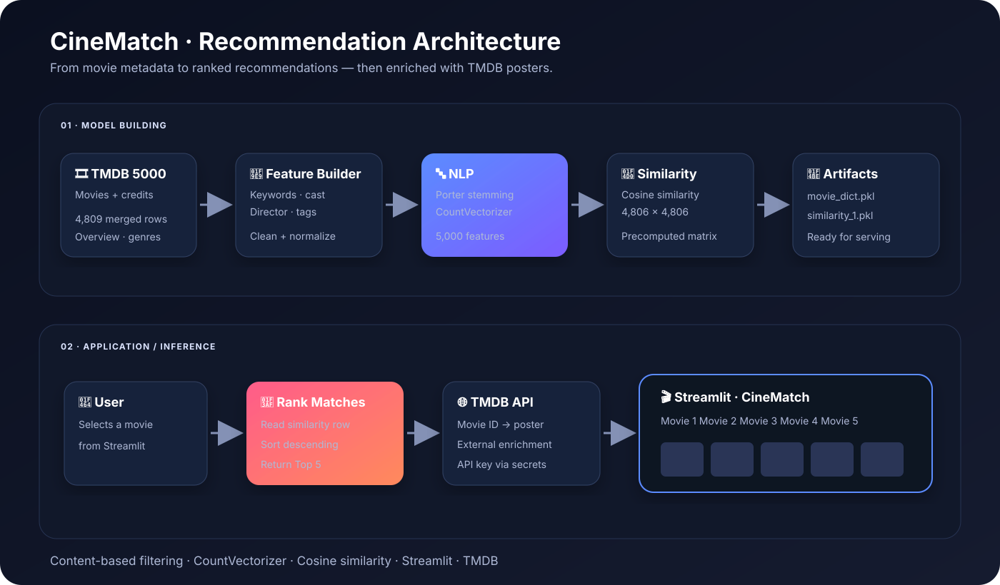

<div align="center">

# 🎬 Movie Recommender System

### **Content-Based Movie Recommendation Engine**

**Select a movie you like → discover five movies with the most similar content profile.**

[](https://www.python.org/)
[](https://streamlit.io/)
[](https://scikit-learn.org/)
[](https://www.themoviedb.org/)

</div>

---

## 📌 Project Overview

The **Movie Recommender System** is a content-based recommendation engine built with the **TMDB 5000 Movie Dataset**.

Rather than relying on user ratings or collaborative behavior, the system recommends movies based on **content similarity**. Each movie is represented using its:

- 🎞️ Overview
- 🎭 Genres
- 🔑 Keywords
- 👥 Top cast
- 🎬 Director

These features are combined into a text representation, processed with NLP techniques, converted into numerical vectors, and compared using **cosine similarity**.

---

## 🏗️ System Architecture



---

## ⚙️ Recommendation Pipeline

| Stage | Implementation |
|---|---|
| **Data ingestion** | TMDB 5000 movies + credits |
| **Data integration** | Merge movie metadata with credits |
| **Feature engineering** | Overview, genres, keywords, cast, director |
| **Text preprocessing** | Lowercasing + Porter stemming |
| **Vectorization** | CountVectorizer with up to 5,000 features |
| **Similarity engine** | Cosine similarity |
| **Recommendation** | Rank nearest content profiles |
| **Presentation** | Streamlit + TMDB poster API |

### Key dimensions

**4,809** merged records  
→ **4,806** final recommendation records  
→ **5,000** maximum text features  
→ **4,806 × 4,806** precomputed similarity matrix

---

## 🧠 How Recommendations Work

For a selected movie, the application:

1. Finds the movie in the processed metadata.
2. Retrieves its corresponding row from the similarity matrix.
3. Compares it against every other movie.
4. Sorts movies by similarity score.
5. Excludes the selected movie itself.
6. Returns the **top 5 recommendations**.
7. Uses TMDB to retrieve poster artwork for the results.

The core similarity operation is:

```python
cosine_similarity(vectors)
```

The text representation is generated using:

```python
CountVectorizer(
    max_features=5000,
    stop_words="english"
)
```

---

## 🔄 Inference Flow

```text
User selects a movie
        │
        ▼
Processed movie metadata
        │
        ▼
Precomputed similarity matrix
        │
        ▼
Rank similarity scores
        │
        ▼
Top 5 recommendations
        │
        ▼
TMDB poster lookup
        │
        ▼
Streamlit interface
```

---

## 🌐 TMDB Integration

TMDB is used as a **presentation/enrichment layer**, not as the recommendation engine.

The recommendation model determines **which movies are similar**. The TMDB API is then used to retrieve poster artwork using each movie's ID.

```text
Recommendation Model
        │
        └── Movie IDs
              │
              ▼
          TMDB API
              │
              └── Poster images
                    │
                    ▼
                Streamlit UI
```

🔐 **The TMDB API key is never hard-coded.** Configure it through an environment variable or Streamlit secrets.

---

## 📊 Dataset

This project uses the **TMDB 5000 Movie Dataset**:

- `tmdb_5000_movies.csv`
- `tmdb_5000_credits.csv`

The dataset is **not committed to the repository**.

Place both files inside `data/` before running the model-building script.

---

## 🗂️ Repository Structure

```text
dangerddrcrsys/
│
├── app/
│   └── app.py                  # Streamlit application
│
├── assets/
│   └── architecture.svg        # System architecture
│
├── data/
│   └── README.md               # Dataset instructions
│
├── notebooks/
│   └── movie_recommendation.ipynb
│
├── scripts/
│   └── build_model.py          # Model-building pipeline
│
├── movie_dict.pkl              # Processed movie metadata
├── similarity_1.pkl            # Precomputed similarity matrix
│
├── .gitignore
├── requirements.txt
└── README.md
```

> **Note:** The similarity artifact is generated by `scripts/build_model.py` and is required by the Streamlit application.

---

## 🚀 Run Locally

### 1. Clone and install dependencies

```bash
git clone https://github.com/rohitsharma2408/dangerddrcrsys.git
cd dangerddrcrsys
pip install -r requirements.txt
```

### 2. Add the dataset

```text
data/
├── tmdb_5000_movies.csv
└── tmdb_5000_credits.csv
```

### 3. Build the recommendation artifacts

```bash
python scripts/build_model.py
```

This generates:

```text
movie_dict.pkl
similarity_1.pkl
```

### 4. Configure TMDB

**Windows PowerShell**

```powershell
$env:TMDB_API_KEY="your_api_key"
```

**Linux / macOS**

```bash
export TMDB_API_KEY="your_api_key"
```

For Streamlit deployment, use:

```toml
TMDB_API_KEY = "your_api_key"
```

### 5. Launch the application

```bash
streamlit run app/app.py
```

---

## 🛠️ Technology Stack

**Python** · **Pandas** · **NumPy** · **NLTK** · **Scikit-learn** · **Streamlit** · **Requests** · **TMDB API**

### Core ML / NLP concepts

- Content-based filtering
- Feature engineering
- Text preprocessing
- Porter stemming
- Bag-of-words representation
- Cosine similarity
- Precomputed similarity retrieval

---

## 🔭 Future Improvements

- [ ] 🔎 Search-based movie selection
- [ ] 🎭 Genre, actor, and director filters
- [ ] ⭐ Movie ratings and detailed metadata
- [ ] 💡 Explain why each movie was recommended
- [ ] 🧹 Better handling of duplicate titles
- [ ] 🤝 Hybrid content + collaborative filtering
- [ ] 📏 Recommendation evaluation metrics
- [ ] 🚀 Production deployment

---

<div align="center">

### 🎬 Movie Recommender System

**Built by Rohit Sharma · Machine Learning · Data Science**

</div>
